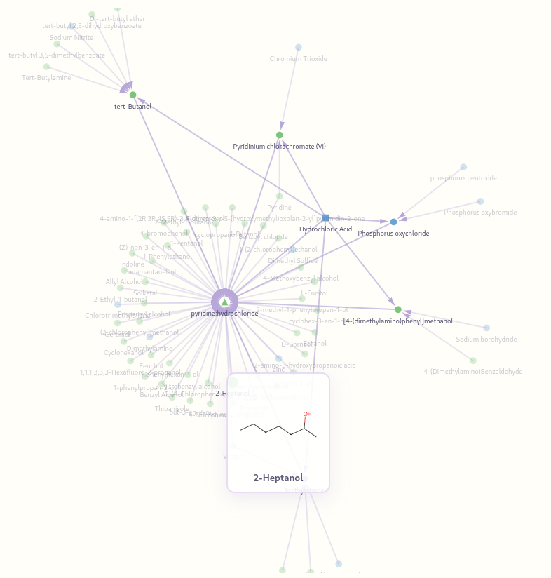

# Reactions Explorer

**Reactions Explorer** is an interactive app for exploring chemical reaction pathways generated and validated with LLMs.
It visualizes how simple compounds connect to complex ones through thousands of reactions, lets users search routes, and displays LLM-generated descriptions for compounds and reactions.

---

## Features

* **43k+ validated reactions**, including cleaned data from the [Open Reaction Database](https://open-reaction-database.org/).
* **Interactive D3.js graph** — click compounds or reactions to view details.
* **Validated LLM descriptions** for many compounds and common reactions.

---

## Getting Started


1. **Start a local HTTP server** in the project directory:

```bash
python -m http.server 8000
```

2. **Open the app in your browser**:
   Navigate to `http://localhost:8000/index.html`

> Note: The app is a static frontend using D3.js; the Python server is only needed to serve the files locally.

---

## How to Use

**Selecting compounds**

* Left-click “Sources” or “Targets” to set the active list.
* Right-click a compound in the catalog → add to active list.
* Right-click a compound in a list → remove it.

**Building the graph**

* Add at least one **target** compound, then press **Submit**.
* Use catalog checkboxes to show/hide compounds in the graph.

**Clearing the graph**

* Remove all compounds from both lists, then press **Submit**.
  *(We’ll add a proper “Clear” button later.)*

**Exploration**

* Click **vertices** (compounds) → description.
* Click **edges** (reactions) → linked reactions info.
* Adjust **N** (max path length) and **k** (number of paths) for different routes.

---

### Support the Project

If you find this project useful and would like to support its development, you can send a small contribution to help us maintain and improve it.

**Crypto wallets:**

* **BTC:** `bc1q27hevh5ygm85rupfxn54dlndg5v3s8jqr8l20l`
* **ETH:** `0x98977B1AD4Ac62E529De5Bc0B87f105882C7F58a`

Thank you!
